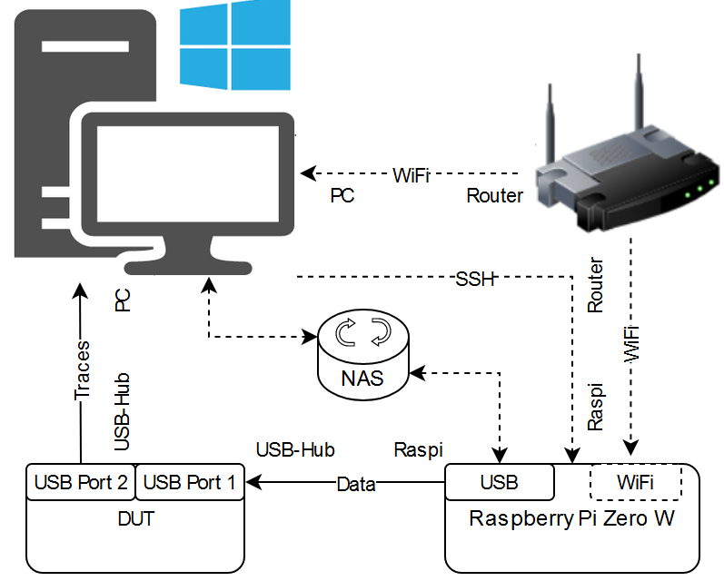

# USB Simulator

The idea comes from Mauch Nico to lighten the amount of work for USB sticks plug in&out during the media testing. Raspberry Pi Zero can be convert into a USB Drive emulator that can be accessed within a local network. This can be useful to transfer files into devices (e.g. DUT) that have a USB connection. It's also able to change different filesystems automatically in order to simulate the USB storage device with different filesystems.

In a word the plan is to have a dynamical usb storage device, which is configurable in format and content.
## Big Picture

## Preparation

| Hardware                   | Software                                                       |
| -------------              | -------------                                                  |
| RaspberryPi zero W         | [Raspberry Pi Imanger](https://www.raspberrypi.com/software/)  |
| USB OTG Cable (Data port)  | PuTTy                                                          |
| USB OTG Cable (Power)      | [Xming](https://sourceforge.net/projects/xming/)               |
| micoSD Card (e.g. 128 GB)  |                                                                |
| micoSD Card Reader         |                                                                |
| TP-Link USB WiFi Receiver  |                                                                |

## Current Implementation of This Project
 [Confluence: USB Simulator](https://confluence.jnd.joynext.com/display/APP/USB+Simulator+New)